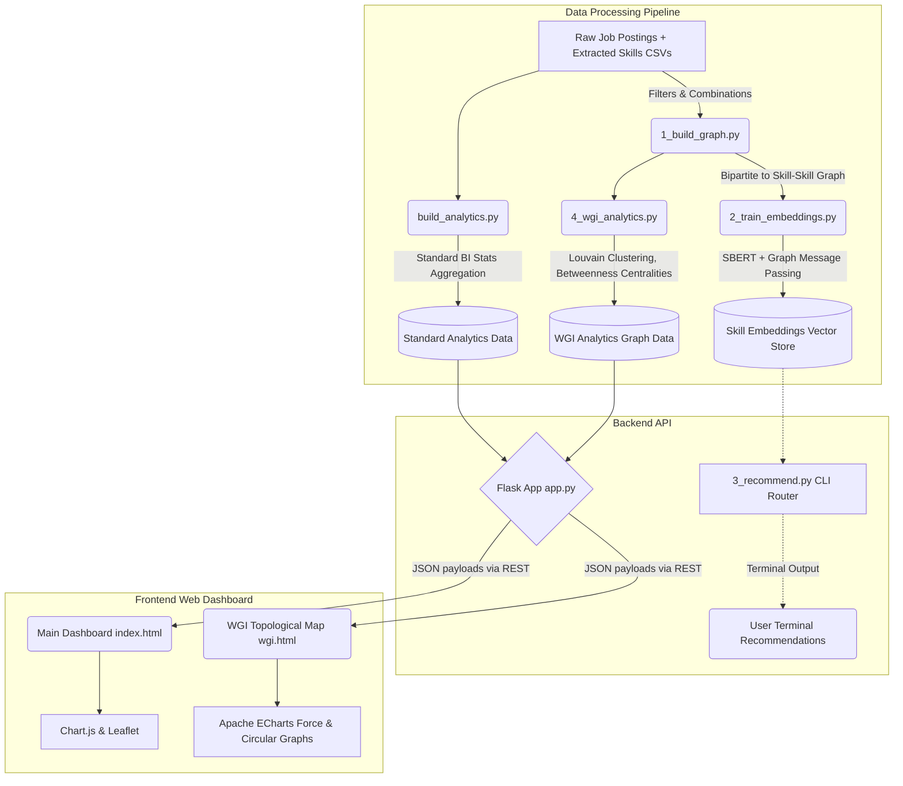
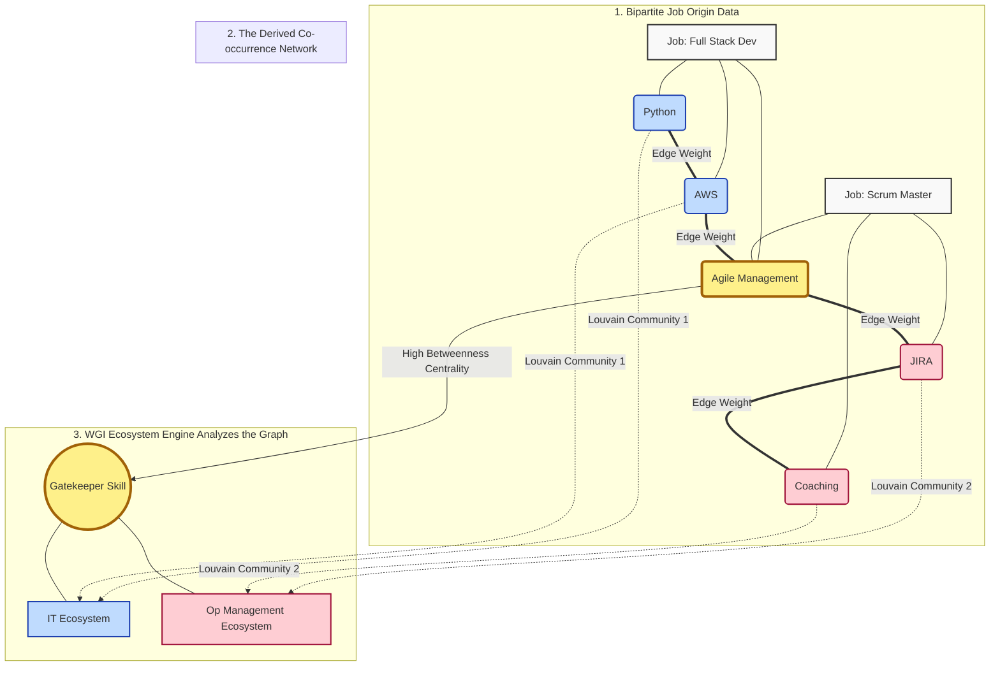

# NLx Labor Market Intelligence

An advanced labor market intelligence dashboard and workforce graph analyzer tailored for the state of Colorado. This tool processes raw job postings to extract critical skills, builds a complex skill co-occurrence graph, and provides interactive visualizations for workforce ecosystems, gatekeeper skills, and career mobility.

🔥 **Live Dashboard: [https://nlx-labor-market.vercel.app/wgi](https://nlx-labor-market.vercel.app/wgi)**

 <!-- Replace with actual screenshot path if available -->

---

## � The Problem Statement

Traditional labor market intelligence generally relies on processing and counting **job titles** (e.g., how many "Data Scientists" exist vs. "Software Engineers"). However, the labor market is far more nuanced. Job titles are highly unstructured, arbitrary, and constantly evolving. 

The most granular unit of labor is actually **skills**. A "Business Analyst" at a tech startup might need entirely different competencies than a "Business Analyst" at a manufacturing plant. This project aims to solve the problem of opaque labor transitions by mapping the economy as a **topological network of interconnected skills** rather than discrete job roles.

By analyzing how skills co-occur across thousands of distinct job postings, we can mathematically deduce the underlying **Skill Ecosystems** of an economy. We can identify isolated "islands" of specialized labor, high-demand "gatekeeper" skills that bridge different industries, and quantify the velocity (and difficulty) of career transitions between disparate roles.

---

## 🏗️ Technical Architecture & Stack Deep Dive

Our project is heavily pipeline-driven, taking massive volumes of unstructured job descriptions through sophisticated NLP mapping, graph theory processing, and a lightweight web interface.

### The Stack

#### Data Pipeline & Machine Learning
*   **Python, Pandas, NumPy**: Standardized data manipulation.
*   **NLP Embeddings (Sentence-Transformers)**: We use `all-MiniLM-L6-v2` (SBERT) to vectorize raw skill text. This ensures we don’t just match exact terms, but capture the semantic essence of a skill.
*   **NetworkX & Python-Louvain**: Used heavily for graph traversal, centrality computations, and community detection algorithms.
*   **Graph Message Passing / Spectral Smoothing**: To infuse graph context dynamically into pure NLP embeddings, ensuring related neighbor nodes influence a skill's vector shape.

#### Backend
*   **Flask / Python**: Serves pre-computed analytics snapshots (`.pkl`) as rapidly parsed JSON to frontend endpoints. Completely lightweight and stateless.

#### Frontend
*   **Vanilla JS, HTML5, CSS3**: Zero heavy-framework overhead for pure performance.
*   **Chart.js**: powers standard analytics charts (histograms, bar charts).
*   **Leaflet**: handles geographical pin drops of labor densities in Colorado.
*   **Apache ECharts**: orchestrates massive, GPU-accelerated node/edge rendering for our complex Workforce Circular Ecosystem maps.

### Architecture Diagram



---

## 🌐 The Graph Topology Structure

To achieve this graph intelligence, our pipeline must first convert linear CSVs into complex mathematical structures.

### 1. From Jobs to Edges
A job posting is essentially a collection of skills (a bipartite relationship). We collapse this mapping into a **co-occurrence network** where:
*   **Nodes**: Unique Taxonomy Skills (e.g., "Python", "Nursing").
*   **Edges**: Are formed between two skills if they appear together in the same job posting.
*   **Edge Weights**: The raw count of how many unique job postings contain *both* skills.

### 2. Graph Intelligence Processing
Once the primary graph is formulated, `4_wgi_analytics.py` applies three distinct algorithms to the structure to extract meaning:
*  **Ecosystem Detection**: We execute **Louvain community detection algorithms** over the weighted edges to find isolated bubbles of tightly knit skills, organically grouping them without manual labeling (e.g., uncovering that Data Science and MLOps are mathematically a single cluster, segregated from HR Management).
*  **Gatekeeper Rankings**: We compute **Betweenness Centrality** across the network's shortest paths to unearth "bridge" skills. A gatekeeper skill is one that rarely exists exclusively inside one ecosystem, but instead provides a connective tether between entirely disparate fields (e.g., "Customer Service", "Project Management software").

### Workflow Concept Map



---

## 🚀 Getting Started

### Prerequisites

*   Python 3.9+
*   Node (for deployment workflows, optional)

### Installation

1.  Clone the repository:
    ```bash
    git clone https://github.com/JAGAN666/nlx-labor-market-intelligence.git
    cd nlx-labor-market-intelligence
    ```

2.  Install the Python backend dependencies:
    ```bash
    pip install -r requirements.txt
    ```

### Running the Application Locally

1.  **Ensure Data Models Exist:** In a fresh clone, make sure you have the required `colorado.csv` and `colorado_processed.csv` files, and you have run the pipeline scripts sequentially (`1_build_graph.py` -> `5_precompute_layout.py`) to generate `analytics.pkl`, `skill_graph.pkl`, and `wgi_graph.pkl`.

2.  **Start the Flask Server:**
    ```bash
    python app.py
    ```
    The server will host the application at `http://127.0.0.1:5050`.

3.  **View the App:**
    *   **Main Dashboard:** `http://localhost:5050/`
    *   **Workforce Graph Intelligence Ring:** `http://localhost:5050/wgi`

### Using the Recommendation CLI

To find your next best skill path based on your resume, run:
```bash
python 3_recommend.py --skills "Microsoft Excel, Customer Service"
```

## 🌐 Deployment

The repository comes pre-configured for modern serverless hosting.
*   **Vercel:** Driven via `vercel.json` allocating `@vercel/python` for backend routing.
*   **Netlify:** Supported via `netlify.toml`.
